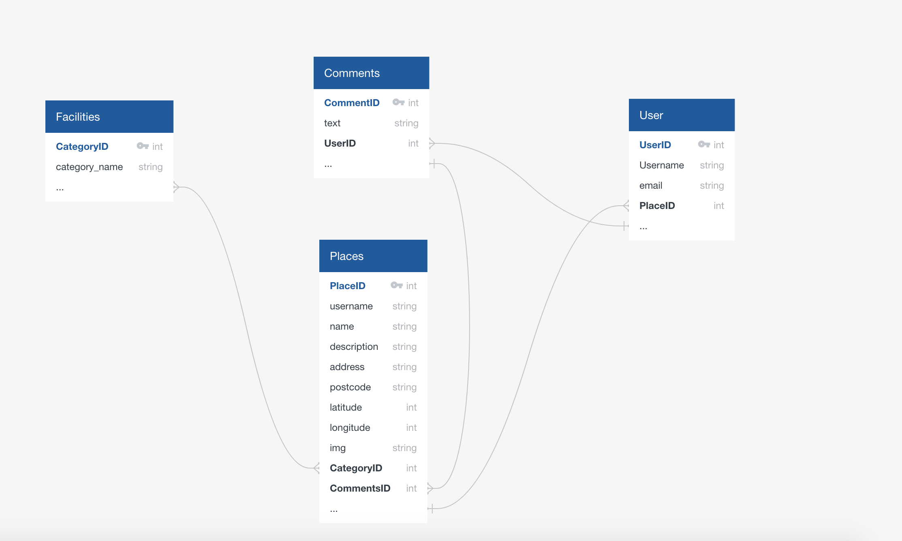
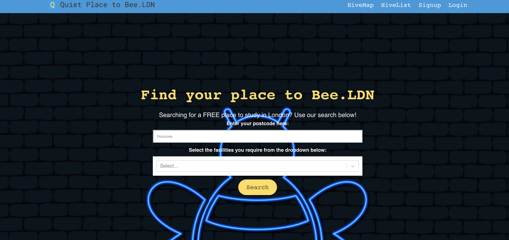
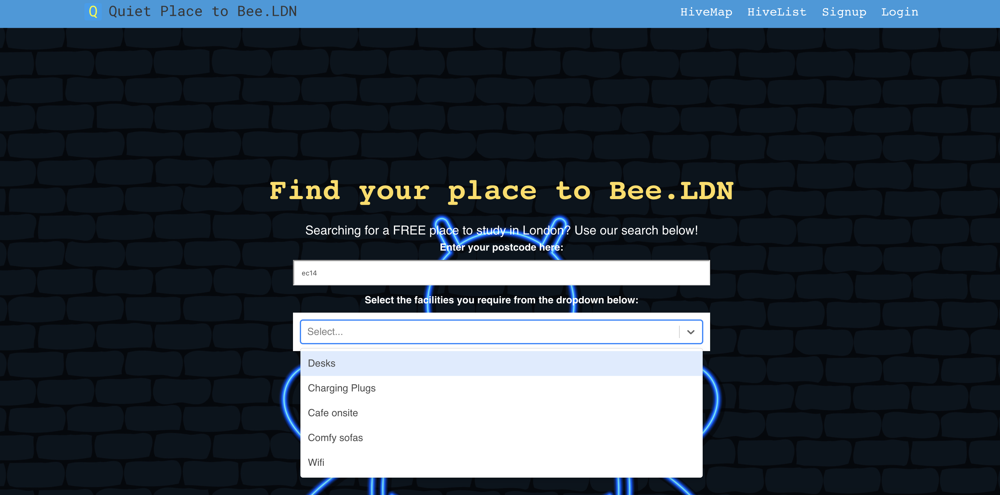
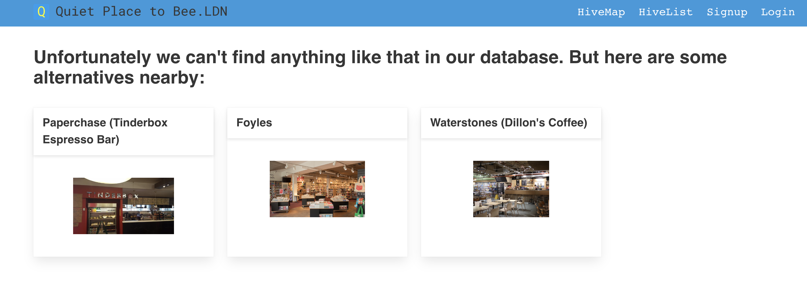
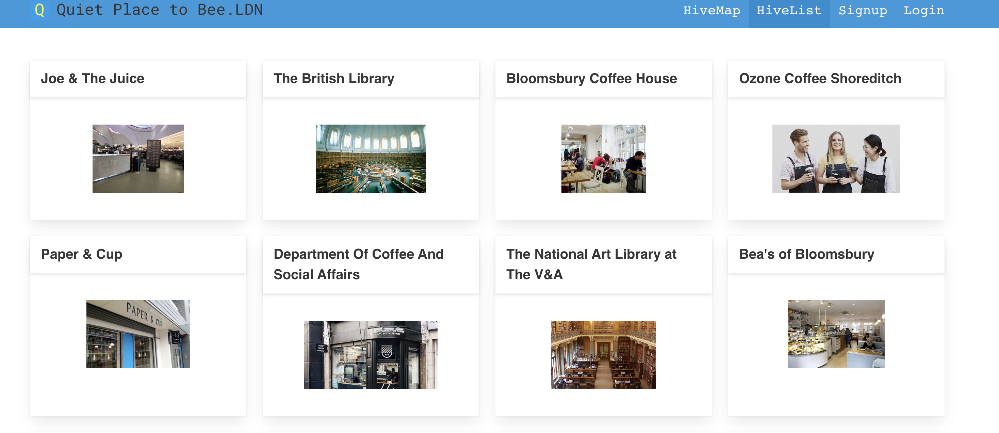
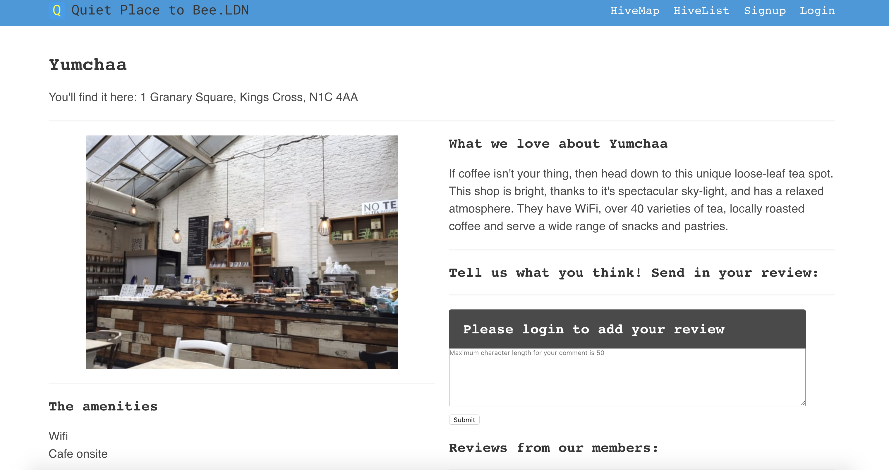
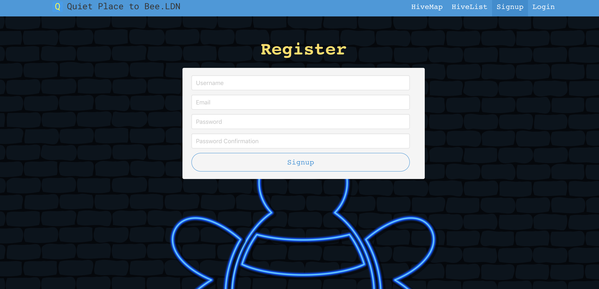
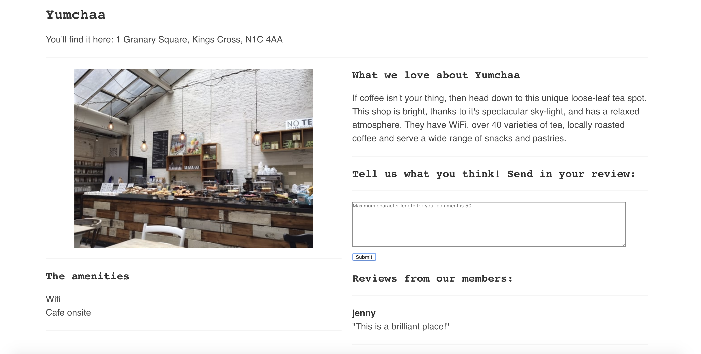
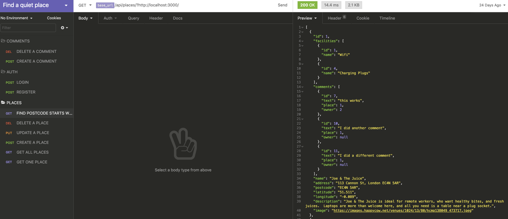

# Find a quiet place to Bee Project

## Overview

This was my final solo project on the Software Engineering Immersive course at General Assembly.

**A Quiet Place to Bee.LDN** is an app where users can search for a quiet place to study by postcode in London and by the facilities they require: WiFi, comfy sofas, desks, charging plugs, and onsite cafe. 

I got my inspiration from project three ('Out and About' events) where our group was unable to find a suitable place to study in London. I couldn't find a website that had a list with more than ten places with user reviews - so this was a great opportunity to create something myself!

## Brief

To plan and build a full-stack application by making my own backend and frontend in one-week. The app must use a Python Django API (Django REST) to serve data from a Postgres database. This must incorporate a separate frontend which is built with React.

## Technologies

The app was built with:

- React
- Mapbox
- Bulma
- Python
- Django
- PostgreSQL
- PostGIS
- QuickDBD

## Deployment

This application was deployed on Heroku at https://study-places-ldn.herokuapp.com/

## Getting started

```
<!-- To install all the packages in the frontend directory: -->
$ yarn

<!-- To install all the packages in the root directory: -->
<!-- Install Django and a shell in the root directory -->
$ pip install pipenv
$ pipenv install django==2.2.10
$ pipenv shell

<!-- Create the postgreSQL database -->
$ pipenv install psycopg2-binary  
$ createdb sei-project-4

<!-- Migrate everything from the backend -->
$ python manage.py migrate

<!-- Seed your database by running the following command -->
$ python manage.py loaddata places/seeds.json jwt_auth/seeds.json facilities/seeds.json

<!-- To run the project on localhost:8000 type: -->
$ python manage.py runserver
```

## Website Architecture

Before I created the app, I used an Entity Relationship Diagram (ERD) program from QuickDBD (www.quickdatabasediagrams.com) to help visualise the relationships between the models. 



The app is comprised of the following pages:

### Homepage

The user is able to search for the location where they wish to study by postcode and by multiple categories. 





I added a PostGIS extension, which adds geographic object support to PostgreSQL, turning it into a spatial database. The intention was that, if the user search for a place but nothing was available in that postcode, they could see places that were nearby. 

It meant changing the places model in the backend and using PointField (a GeoDjango-specific geometric field for storing a GEOS Point object that represents a pair of longitude and latitude coordinates) for the location.

```
class Place(models.Model):
  name = models.CharField(max_length=50) 
  address = models.CharField(max_length=50)
  postcode = models.CharField(max_length=8)
  latitude = models.DecimalField(max_digits=6, decimal_places=3, null=True)
  longitude = models.DecimalField(max_digits=6, decimal_places=3, null=True)
  location = models.PointField(null=True)
  description = models.CharField(max_length=300, default='')
  image = models.CharField(max_length=500)
  facilities = models.ManyToManyField('facilities.Facility', related_name='facilities', blank=True)
```

I amended views.py so that the places were ordered by distance:

```
    def get(self, request):

      queryset = None 

      latitude = self.request.query_params.get('latitude', None)
      longitude = self.request.query_params.get('longitude', None)    
      if latitude is not None and longitude is not None:
        user_location = Point(float(longitude), float(latitude), srid=4326)
        queryset = Place.objects.annotate(distance=Distance('location', user_location)).order_by('distance')[0:3]
      else:
        queryset = Place.objects.all()

      postcode = self.request.query_params.get('postcode', None)
      if postcode is not None:
        queryset = queryset.filter(postcode__istartswith=postcode)

      facilities = self.request.query_params.get('facilities', None)
      if facilities is not None:
        queryset = queryset.filter(facilities__name__icontains=facilities)
      
      serialized_place = PopulatedPlaceSerializer(queryset, many=True)

      return Response(serialized_place.data)
```

So if there's nothing within the vicinity of postcode W1G in Mayfair, the app suggests places that are nearby:



PaperChase is located in postcode W1T, Foyles is WC2H and Waterstones is in WC1E. 

### Places

Here's a snippet of the list of places found on the 'HiveList':



### Map

Using Mapbox and its handy popup and marker components, users can see all the study places on a map (called 'HiveMap' on the app). 


### Register & Leaving A Review

If the user isn't logged in, they can't make comments:



Once registered and logged in, users have the ability to review the study place. 





## Wins & Key Learnings

Because we had one week to build the project, my intention was to start with fewer models and take a steady pace with using Django. And I'm really glad that I took this strategy! It meant that I could spend a significant amount of time implementing the PostGIS extension and querysets to make the search more sophisticated. 

However I still ran out of time and I couldn't test my React components. Nevetheless, I used Insomnia to test every API call to ensure that I could retrieve the JSON data and check the responses. I made necessary adjustments when the data returned the wrong response.  



## Future Improvements

I would love to add a component on the SHOW page where users can see a list of places nearby (now that PostGIS is working) and a weather forecast.

Also, this is the London edition of the app - it would be great to expand it to other cities!
